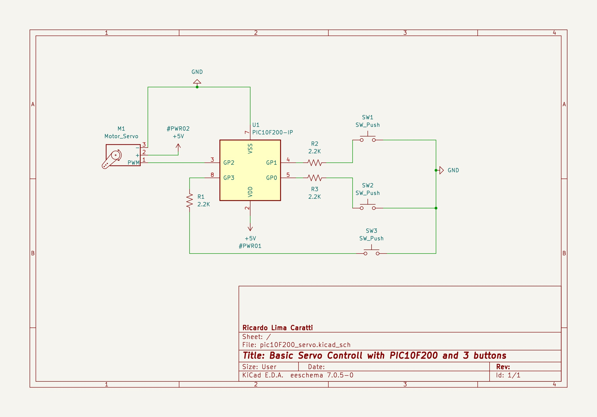

# PIC10F200 Servo example

While it's technically possible to control a servo using the PIC10F200, the microcontroller's limited program and data memory, along with the absence of specialized PWM hardware, impose substantial challenges. Developers must optimize code significantly and may need to compromise on control precision or additional functionalities to fit within the device's constraints.

This folder shows an example of using Servo with PIC10F200. 

## Content

1. [Challenges in Controlling a Servo using PIC10F200 Microcontroller](#challenges-in-controlling-a-servo-using-pic10f200-microcontroller)
2. [PIC10F200 with Servo and three buttons schematic](#pic10f200-with-servo-and-three-buttons-schematic)
    * [Kicad schematic](./KiCad/)
3. [PIC10F200 PINOUT](#pic10f200-pinout)    
4. [MPLAB-X Project](./MPLAB_EXAMPLES/)
5. [PIC10F200 with Servo and three buttons prototype](#pic10f200-with-servo-and-three-buttons-prototype)
6. [References](#references)

## Challenges in Controlling a Servo using PIC10F200 Microcontroller

### 1. Limited Program Memory:

* The PIC10F200 has only 256 words of program memory, which can be a constraint when implementing complex control algorithms or using libraries.
* Efficient code optimization and memory management techniques are crucial to fit the servo control program within the limited memory space.

### 2. Data Memory Constraints:

* With only 16 bytes of data memory, storing variables, lookup tables, and other data required for servo control can be challenging.
* Careful data structure selection and memory allocation strategies are necessary to optimize memory usage.

### 3. PWM Implementation Challenges:

* The PIC10F200's built-in PWM module lacks features like programmable frequency and duty cycle, which are essential for precise servo control.
* Bit-banging techniques or software-based PWM implementations can be used to overcome these limitations, but they require additional programming effort and may introduce timing inaccuracies.

### 4. Timer Resolution:

* The PIC10F200's timer resolution may not be sufficient for high-precision servo control, especially when using low-frequency PWM signals.
* Timer overflow and prescaling techniques can be used to increase the effective resolution, but this can add complexity to the programming and increase interrupt overhead.

### 5. Limited Interrupt Capability:

* The PIC10F200 has a limited number of interrupt sources, which can be a constraint when handling multiple servos or other peripherals that require interrupt servicing.
* Interrupt priority and scheduling mechanisms may be necessary to ensure efficient and reliable servo control.

### 6. External Components:

* Additional components like resistors, capacitors, and level shifters may be required to interface the PIC10F200 with the servo motor, increasing the overall system complexity and cost.

## PIC10F200 with Servo and three buttons schematic

## PIC10F200 PINOUT

## PIC10F200 with Servo and three buttons prototype

## Contribution

If you've found value in this repository, please consider contributing. Your support will assist me in acquiring new components and equipment, as well as maintaining the essential infrastructure for the development of future projects. [Click here](https://www.paypal.com/donate/?business=LLV4PHKTXC4JW&no_recurring=0&item_name=Your+support+will+assist+me+in++maintaining+the+essential+infrastructure+for+the+development+of+future+projects.+&currency_code=BRL) to make a donation or scan the QR code provided below. 

## References

* [Video - Servo motor, indirect addressing, and electronic lock - Part 10 Microcontroller Basics (PIC10F200)](https://youtu.be/lZipBSAy0aA?si=vB2Bhft1P4AmzIAC)
* [Tutorial - Servo motor, indirect addressing, and electronic lock - Part 10 Microcontroller Basics (PIC10F200)](https://www.circuitbread.com/tutorials/servo-motor-indirect-addressing-and-electronic-lock---part-10-microcontroller-basics-pic10f200)
