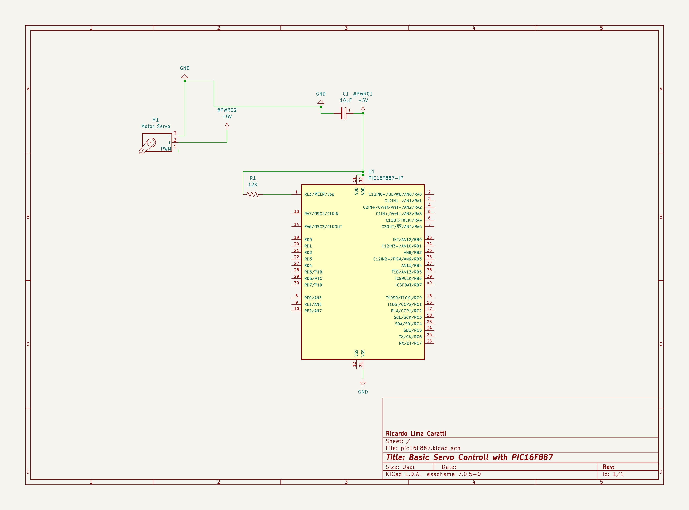
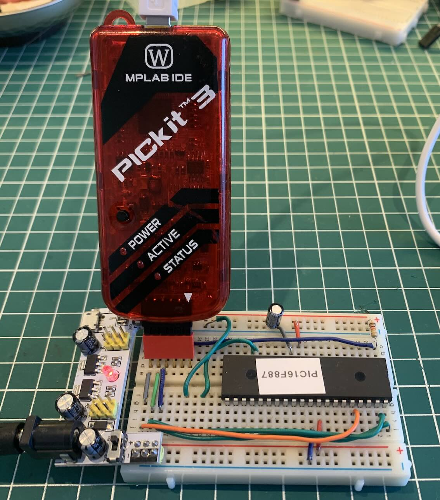
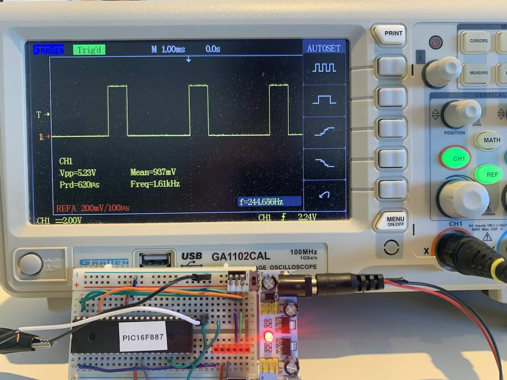
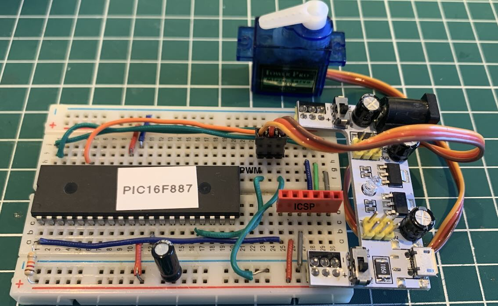

# Exanples with Servomotor

**This example with Servo and PWM is still not complete. The experiments worked partially due to the lower frequency that I managed to achieve in the PIC16F628A and PIC16F887 to operate the servos, which was 243 Hz (some Servos did not respond well to this operating frequency); The same experiment performed on the ATMEGA328, for example, worked better. In this microcontroller, the operating frequency is around 50 Hz. I intend to return to this experiment to correct this.**

## Example 1 - Basic Servomotor controll 
 

### Description of how to connect a servomotor to the PIC16F628A microcontroller

1. **Signal Connection (PWM):** Connect the signal wire of the servo (usually the colored wire, not black or red) to the CCP1 pin of the PIC16F628A. This is pin 9, labeled as RB3/CCP1.

2. **Power Supply (5V) and Ground (GND):** Connect the power wire of the servo (usually red) to a 5V power source. Connect the ground wire of the servo (usually black or brown) to the ground (GND). Ensure that the PIC16F628A is also properly connected to a 5V power source and ground. **Use a separate power source to power the servo.**.

### Additional Notes:

- Ensure that the power supply for the servo can provide sufficient current without overloading the PIC's circuit.
- Be careful with the power requirements of the servo as some can draw significant current that may exceed what the microcontroller circuit can provide safely. Consider using a separate power supply for the servo if necessary.
- The CCP1 (Capture/Compare/PWM) module of the PIC16F628A is used for generating the PWM signal, which controls the position of the servo.

### Schematic PIC16F628A

 

### Schematic PIC16F887

 

### About the Servo

## Videos

* [PIC16F887 and Servo (PWM)](https://youtu.be/YDyLSMGPXZI?si=9wzmTlIvT2DltXnA) 

## References 

* [Servo Motor Control by Using Microcontroller PIC16F877A](https://www.instructables.com/Servo-Motor-Control-by-using-Microcontroller-PIC16/)
* [Basic Servo Motor Controlling with Microchip PIC Microcontroller](http://www.ermicro.com/blog/?p=771)
* [Generating PWM signals on GPIO pins of PIC Microcontroller](https://circuitdigest.com/microcontroller-projects/generating-pwm-signals-on-gpio-pins-of-pic-microcontroller)
* [GERADOR DE PWM AJUSTÁVEL | Curso de PIC](https://youtu.be/2Vc-I7it1rU?si=GxyW8qcaOKco1eZ8)

* [All About PIC Pulse Width Modulation](https://www.servomagazine.com/magazine/article/may2014_Henry)

