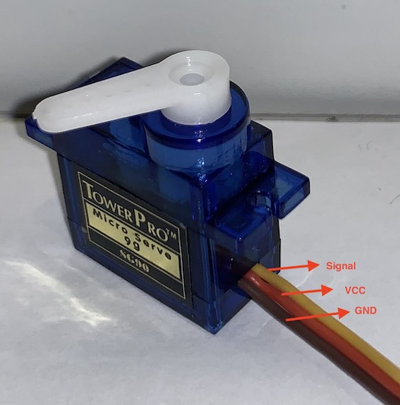

# PIC10F200, PIC16F628A and PIC16F887 with Servo 

## Content

1. [About Servo](#about-servo) 
2. [PIC10F200](./PIC10F200/)
3. [PIC16F628A](./PIC16F628A/)
4. [PIC16F887](./PIC16F887/)

## About Servo

A servo motor is a type of rotary actuator or linear actuator that allows for precise control of angular or linear position, velocity, and acceleration. It consists of a suitable motor coupled to a sensor for position feedback. Servo motors are controlled by sending an electrical signal, in the form of Pulse Width Modulation (PWM), to the motor. PWM is a technique used to encode a message into a pulsing signal. In the context of servo motors, it involves varying the width of the pulses to control the motor's rotation or position.

### Introduction to Servo Motors and PWM

**Servo Motor**: Servo motors are widely used in robotics, manufacturing, and automation. They are particularly prized for their ability to achieve precise control over motion. Servo motors work on the principle of negative feedback, where the control signal determines the position of the motor, but the actual position is fed back to ensure the correct position is maintained or adjusted as needed.

**PWM (Pulse Width Modulation)**: PWM is a modulation technique used to control the amount of power delivered to an electrical device, in this case, a servo motor. It effectively controls the motor's speed and position by varying the width and frequency of the electrical pulses sent to the motor. The duty cycle of these pulses (the percentage of time the signal is on versus off) determines the motor's behavior.

 
## Servo Image

## Videos

* [PIC16F887 and Servo (PWM)](https://youtu.be/YDyLSMGPXZI?si=9wzmTlIvT2DltXnA) 

## References 

* [Servo Motor Control by Using Microcontroller PIC16F877A](https://www.instructables.com/Servo-Motor-Control-by-using-Microcontroller-PIC16/)
* [Basic Servo Motor Controlling with Microchip PIC Microcontroller](http://www.ermicro.com/blog/?p=771)
* [Generating PWM signals on GPIO pins of PIC Microcontroller](https://circuitdigest.com/microcontroller-projects/generating-pwm-signals-on-gpio-pins-of-pic-microcontroller)
* [GERADOR DE PWM AJUSTÁVEL | Curso de PIC](https://youtu.be/2Vc-I7it1rU?si=GxyW8qcaOKco1eZ8)

* [All About PIC Pulse Width Modulation](https://www.servomagazine.com/magazine/article/may2014_Henry)

