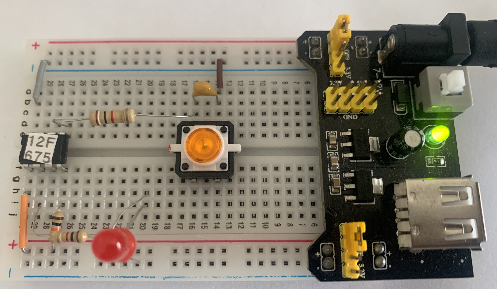

# PIC12F675 and Push Button with Interrupt

This project, while simple in terms of its functionalities, can assist you in setting up more robust projects. The goal here is to present shortcuts for configuring the MPLAB development environment, setting up the microcontroller's registers, the feature of power saving, as well as the use of the interrupt feature, whereby a specific code can be executed in response to the press of a button.

Additionally, this project aims to provide examples in C (XC8) and Assembly (pic-as) as starting points for your own code.

## Content

1. [Schematic](#pic12f675-push-button-and-led-schematic)
    * [About debounce capacitor](#about-debounce-capacitor)
    * [Kicad Schematic](./KiCad/)
2. [PIC12F675 PINOUT](#pic12f675-pinout)
3. [Prototype](#pic12f675-push-button-and-led-prototype)
4. [Example in C](#example-in-c)
5. [Example in Assembly ](#example-in-assembly)
6. [MPLAB projects](./MPLAB_EXAMPLE/)
7. [References](#references)


## PIC12F675, push button and LED schematic


The previous diagram illustrates a simple application to turn on an LED. However, it is possible to add a few components to make the same system drive a high-power DC motor using a MOSFET like the IRF640. The following diagram illustrates this configuration.


### About debounce capacitor

Using a capacitor for debouncing a button press in a circuit, especially in one involving a microcontroller, offers several benefits. When a button is pressed, it doesn't simply close the circuit; instead, due to mechanical imperfections, it can "bounce", causing rapid, multiple transitions between the ON and OFF states in a very short time. This bouncing can lead to multiple interrupts being triggered by a single press, which could cause unpredictable behavior in the microcontroller's response.

The inclusion of a 22 nF (nanofarad) capacitor in parallel with the button (connected to ground and the output pin GP2 through a 1kΩ resistor) serves as a debounce mechanism. Here are some benefits of this approach:

1. **Noise Filtering**: The capacitor acts as a low-pass filter, smoothing out the rapid changes or bounces caused by the mechanical action of the button. This ensures that the microcontroller sees a clean, stable transition from the unpressed to the pressed state.

2. **Prevention of Multiple Triggers**: By filtering out the noise and bounces, the capacitor prevents the microcontroller from detecting false multiple presses. This means that for each physical press of the button, the microcontroller will only register one interrupt event, improving the reliability of the input.

3. **Simplified Software**: Debouncing can also be achieved through software, by implementing timers or checking the button state over a period to confirm its state. However, a hardware debounce mechanism like a capacitor allows for a simpler and more efficient software design, as the microcontroller can react to button presses without needing to implement additional debouncing logic.

4. **Reduced Power Consumption**: In designs where power efficiency is crucial, hardware debouncing is advantageous. Software debouncing typically requires the microcontroller to be awake and polling the button state frequently, which consumes more power. With hardware debouncing, the microcontroller can spend more time in low-power modes, waking up only when a true button press event occurs.

5. **Enhanced Response Time**: Since the debouncing is handled by the hardware, the response to a button press can be immediate and precise from the microcontroller's perspective, allowing for faster and more predictable system reactions.


## PIC12F675 PINOUT


## PIC12F675, push button and LED prototype




## Example in C


```cpp

/*
 * 
 * Created on March 15, 2024, 10:57 PM
 * Reference: https://saeedsolutions.blogspot.com/2012/07/pic12f675-pwm-code-proteus-simulation.html
 */


#pragma config FOSC = INTRCIO   // Oscillator Selection bits (INTOSC oscillator: I/O function on GP4/OSC2/CLKOUT pin, I/O function on GP5/OSC1/CLKIN)
#pragma config WDTE = OFF       // Watchdog Timer Enable bit (WDT disabled)
#pragma config PWRTE = OFF      // Power-Up Timer Enable bit (PWRT disabled)
#pragma config MCLRE = OFF       // GP3/MCLR pin function select (GP3/MCLR pin function is MCLR)
#pragma config BOREN = ON       // Brown-out Detect Enable bit (BOD enabled)
#pragma config CP = OFF         // Code Protection bit (Program Memory code protection is disabled)
#pragma config CPD = OFF        // Data Code Protection bit (Data memory code protection is disabled)


#define _XTAL_FREQ 4000000			// required for delay Routines. 

#include <xc.h>

/**
 * Handle timer overflow
 */
void __interrupt() ISR(void) {
    GIE = 0;
    if (INTF) {
        GP5 = !GP5;     // Toggle the LED (ON/OFF)
        __delay_ms(100);  // Debounce
        INTF = 0;
    }
    GIE = 1;
}

void main() {

    TRISIO = 0B00000100; // GP2 as digital input / GP5 as digital output 
    ANSEL  = 0;

    // Configures the PIC12F675 to trigger a function call as GP0 / PUSH BUTTON ACTION.

    // INTEDG: Interrupt Edge Select bit -  Interrupt will be triggered on the rising edge
    OPTION_REG = 0B01000000; // see  data sheet (page 12)    
    INTE = 1; // GP2/INT External Interrupt Enable bit
    GIE = 1; // GIE: Enable Global Interrupt

    // Status    
    GP5 = 1;
    __delay_ms(1500);
    GP5 = 0;

    while (1) {
        // Puts the system to sleep.  
        // It will wake-up if:  
        // 1. External Reset input on MCLR pin
        // 2. Watchdog Timer wake-up (if WDT was enabled) - NOT USED IN THIS PROJECT
        // 3. Interrupt from RB0/INT pin, RB port change, or any peripheral interrupt.
        // See page 113 of the PIC16F627A/628A/648A DATA SHEET 
        SLEEP();
    }
}


```

## Example in Assembly 


I couldn't find clear documentation on how to configure the interrupt service using "pic-as". Therefore, I attempted various configurations so that the occurrence of a desired interrupt would redirect the program flow to address 4h (as described in the PIC12F675 Data Sheet). I didn't find an Assembly directive that would instruct the assembler to start the interrupt code at address 4h (the ORG directive didn't seem to work). However, this was made possible by adding special parameters in the project settings/properties, as shown below. Go to properties and set the pic-as **Additional Options: -Wl,-PresetVec=0x0,-PisrVec=0x04**.  Where **resetVec** and **isrVec** are indentifiers declared in Assembly code.   The image below shows that setup. 
 


### ASM code Interrupt setup using MPLAB and pic-as


```asm 

; UNDER  IMPROVEMENTS...
; I couldn't find clear documentation on how to configure the interrupt service using "pic-as". 
; Therefore, I tried some configurations so that the occurrence of a desired interrupt would 
; divert the program flow to address 4h. This was possible by adding special parameters as shown below.
; Go to properties and set pic-as Additiontal Options: -Wl,-PresetVec=0x0,-PisrVec=0x04   
;    
; Author: Ricardo Lima Caratti
; Jan/2024
    
#include <xc.inc>
 
; CONFIG
  CONFIG  FOSC = INTRCIO        ; Oscillator Selection bits (INTOSC oscillator: I/O function on GP4/OSC2/CLKOUT pin, I/O function on GP5/OSC1/CLKIN)
  CONFIG  WDTE = OFF            ; Watchdog Timer Enable bit (WDT disabled)
  CONFIG  PWRTE = OFF           ; Power-Up Timer Enable bit (PWRT disabled)
  CONFIG  MCLRE = ON            ; GP3/MCLR pin function select (GP3/MCLR pin function is MCLR)
  CONFIG  BOREN = ON            ; Brown-out Detect Enable bit (BOD enabled)
  CONFIG  CP = OFF              ; Code Protection bit (Program Memory code protection is disabled)
  CONFIG  CPD = OFF             ; Data Code Protection bit (Data memory code protection is disabled) 
  
; declare your variables here

adcValueL   equ 0x20		; 8 bits less significant value of the adc
adcValueH   equ 0x21		; 8 bits most significant value of the adc
delayParam  equ	0x22  
ind_I	    equ	0x23
ind_J	    equ 0x24	    
   	    
PSECT resetVec, class=CODE, delta=2 
ORG 0x0000	    
resetVec:
    PAGESEL main
    goto main
;
; INTERRUPT IMPLEMENTATION 
; THIS FUNCTION WILL BE CALLED EVERY TMR0 Overflow
; pic-as Additiontal Options: -Wl,-PresetVec=0x0,-PisrVec=0x04    
PSECT isrVec, class=CODE, delta=2
ORG 0x0004     
isrVec:  
    PAGESEL interrupt
    goto interrupt
  
interrupt: 
   
    bcf	    STATUS, 5
    
    bcf	    INTCON, 7	; Disables GIE
    
    ; check if the interrupt was trigged by Timer0	
    btfss   INTCON, 1		; INTCON - INTF: GP2/INT External Interrupt Flag bit
    goto    INT_FINISH
    btfss   GPIO, 5		; Toggle LED (ON/OFF)
    goto    INT_SWITCH_ON
    goto    INT_SWITCH_OFF
INT_SWITCH_ON:    
    bsf	    GPIO,5
    goto    INT_CONTINUE
INT_SWITCH_OFF:    
    bcf	    GPIO,5
INT_CONTINUE:    
    movlw   1
    call    Delay
    bcf	    INTCON, 1  
INT_FINISH:
    bsf	    INTCON, 7		; Enables GIE
    
    retfie    
      
; PSECT code, delta=2
main: 

    
    ; Bank 1
    bsf	    STATUS,5	    ; Selects Bank 1  
    movlw   0B00000100	    ; GP1 as input and GP1, GP2, GP4 and GP5 as digital output
    movwf   TRISIO	    ; Sets all GPIO as output    
    clrf    ANSEL	    ; Disable Analog setup   

    ; OPTION_REG setup
    ; bit 5 = 0 -> Internal instruction cycle clock;
    movlw   0B01000000	
    movwf   OPTION_REG	    
    ; Bank 0
    bcf	    STATUS,5 
   
    clrf    GPIO	; Turn all GPIO pins low
    
    ; ---- if you are using debounce capacitor ---
    movlw   1		; Wait for the debounce capacitor becomes stable 
    call    Delay
    ; ----
    
    ; INTCON setup / enable interrupt 
    ; bit 7 (GIE) = 1 => Enables all unmasked interrupts / Global Interrupt Enable bit
    ; bit 4 (INTE) =  1 => GP2/INT External Interrupt Flag bit
    movlw   0B10010000
    movwf   INTCON   

    ; Debug - Blink LED to indicate that the system is alive
    ; bsf	    GPIO, 5	; LED ON
    ; movlw   6
    ; call    Delay
    ; bcf	    GPIO, 5	; LED OFF
	
MainLoopBegin:		; Endless loop
    sleep      
    goto    MainLoopBegin
     

; ******************
; Delay function
;

Delay:  
    movwf   delayParam
    movlw   100
    movwf   ind_I	; 100 times
    movwf   ind_J	; 100 times 
			; 100 * 100 * delayParam    
DelayLoop:    
    nop                 ; One cycle
    nop                 ; One cycle
    decfsz ind_I, f	; One cycle * (ind_I = ind_I - 1) => if ind_I is 0, after decfsz, it will be 255
    goto DelayLoop      ; Two cycles
    decfsz ind_J, f	; ind_J = ind_J - 1; if ind_J = 0, after decfsz, it will be 255
    goto DelayLoop
    decfsz delayParam,f ; Runs WREG/delayParam * (100 * 100)		 
    goto DelayLoop
    
    return     
    
    
END resetVec


```


## References 

- [Programming PIC16F84A-PIC16F628A Interrupts Tutorial](https://www.bristolwatch.com/k150/f84e.htm)
- [PIC16F628A external interrupt code + Proteus simulation](https://saeedsolutions.blogspot.com/2013/09/pic16f628a-external-interrupt-code.html)
- [Implementing Interrupts Using MPLAB® Code Configurator](https://developerhelp.microchip.com/xwiki/bin/view/software-tools/mcc/interrupts/)
- [Interrupts In PIC Microcontrollers](https://deepbluembedded.com/interrupts-in-pic-microcontrollers/)
- [8-bit PIC® MCU Interrupts](https://developerhelp.microchip.com/xwiki/bin/view/products/mcu-mpu/8bit-pic/peripherals/interrupts/)
