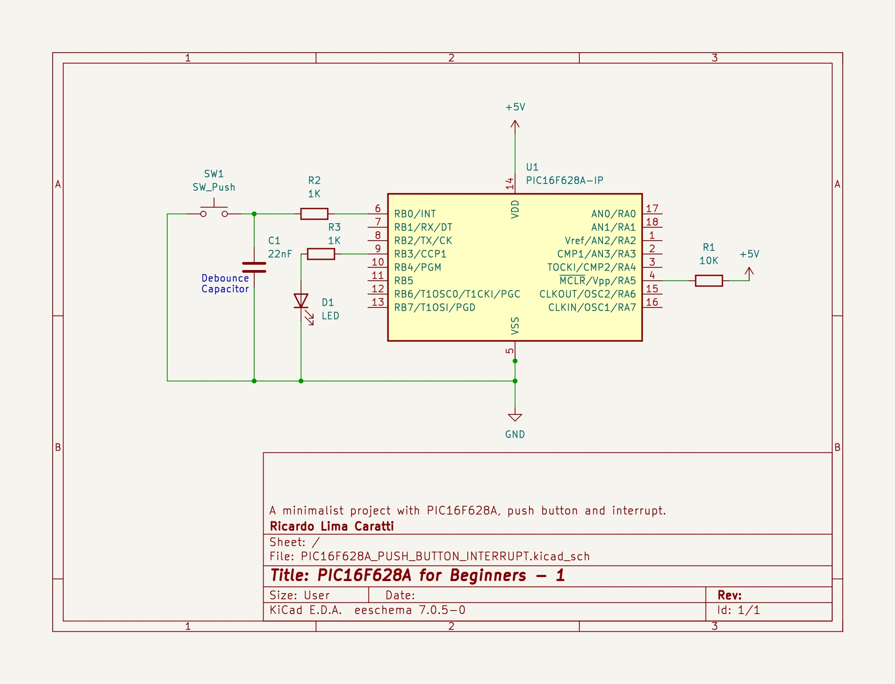

# PIC16F628A and Push Button with Interrupt

## PIC628A and LED Schematic

## PIC16F628A PINOUT

## References 

- [Programming PIC16F84A-PIC16F628A Interrupts Tutorial](https://www.bristolwatch.com/k150/f84e.htm)
- [PIC16F628A external interrupt code + Proteus simulation](https://saeedsolutions.blogspot.com/2013/09/pic16f628a-external-interrupt-code.html)
- [Implementing Interrupts Using MPLAB® Code Configurator](https://developerhelp.microchip.com/xwiki/bin/view/software-tools/mcc/interrupts/)
- [Interrupts In PIC Microcontrollers](https://deepbluembedded.com/interrupts-in-pic-microcontrollers/)
- [8-bit PIC® MCU Interrupts](https://developerhelp.microchip.com/xwiki/bin/view/products/mcu-mpu/8bit-pic/peripherals/interrupts/)
