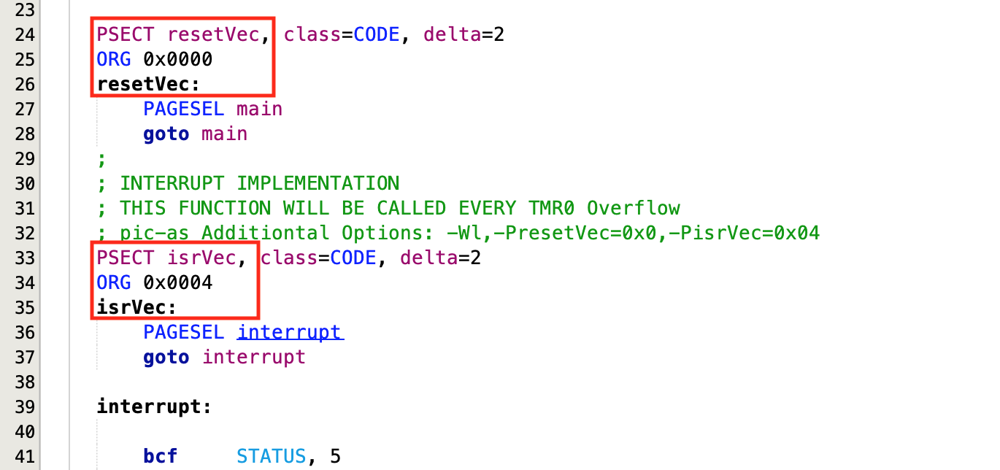

# PIC16F628A and Push Button with Interrupt

This project, while simple in terms of its functionalities, can assist you in setting up more robust projects. The goal here is to present shortcuts for configuring the MPLAB development environment, setting up the microcontroller's registers, the feature of power saving, as well as the use of the interrupt feature, whereby a specific code can be executed in response to the press of a button.

Additionally, this project aims to provide examples in C (XC8) and Assembly (pic-as) as starting points for your own code.


## Content

1. [Schematic](#pic16f28a-with-push-button-and-led-schematic)
    * [About debounce capacitor](#about-debounce-capacitor)
    * [Kicad Schematic](./KiCad/)
2. [PIC16F628A PINOUT](#pic16f628a-pinout)
3. [Prototype](#pic16f28a-with-push-button-and-led-prototype)
4. [Example in C](#example-in-c)
5. [Example in Assembly ](#example-in-assembly)
6. [MPLAB projects](./MPLAB_EXAMPLE/)
6. [References](#references)


## PIC16F28A with PUSH BUTTON and LED Schematic


### About debounce capacitor

Using a capacitor for debouncing a button press in a circuit, especially in one involving a microcontroller, offers several benefits. When a button is pressed, it doesn't simply close the circuit; instead, due to mechanical imperfections, it can "bounce", causing rapid, multiple transitions between the ON and OFF states in a very short time. This bouncing can lead to multiple interrupts being triggered by a single press, which could cause unpredictable behavior in the microcontroller's response.

The inclusion of a 22 nF (nanofarad) capacitor in parallel with the button (connected to ground and the output pin GP2 through a 1kΩ resistor) serves as a debounce mechanism. Here are some benefits of this approach:

1. **Noise Filtering**: The capacitor acts as a low-pass filter, smoothing out the rapid changes or bounces caused by the mechanical action of the button. This ensures that the microcontroller sees a clean, stable transition from the unpressed to the pressed state.

2. **Prevention of Multiple Triggers**: By filtering out the noise and bounces, the capacitor prevents the microcontroller from detecting false multiple presses. This means that for each physical press of the button, the microcontroller will only register one interrupt event, improving the reliability of the input.

3. **Simplified Software**: Debouncing can also be achieved through software, by implementing timers or checking the button state over a period to confirm its state. However, a hardware debounce mechanism like a capacitor allows for a simpler and more efficient software design, as the microcontroller can react to button presses without needing to implement additional debouncing logic.

4. **Reduced Power Consumption**: In designs where power efficiency is crucial, hardware debouncing is advantageous. Software debouncing typically requires the microcontroller to be awake and polling the button state frequently, which consumes more power. With hardware debouncing, the microcontroller can spend more time in low-power modes, waking up only when a true button press event occurs.

5. **Enhanced Response Time**: Since the debouncing is handled by the hardware, the response to a button press can be immediate and precise from the microcontroller's perspective, allowing for faster and more predictable system reactions.


## PIC16F628A PINOUT


## Example in C

```cpp 

/**
 * PUSH BUTTON DETECTING USING INTERRUPT
 * 
 * Simple way to blink a LED 
 * 
 * Author: Ricardo Lima Caratti
 * Mar/2004
 */
#include <xc.h>
 
#pragma config FOSC = INTOSCIO  // Internal oscillator.
#pragma config WDTE = OFF       // Watchdog Timer disabled 
#pragma config PWRTE = OFF      // Power-up Timer disable
#pragma config MCLRE = ON       // MCLR pin function is digital input
#pragma config BOREN = OFF      // Brown-out Reset enabled
#pragma config LVP = OFF        // Low Voltage Programming disabled
#pragma config CPD = OFF        // Data EEPROM Memory Code Protection disabled
#pragma config CP = OFF         // Flash Program Memory Code Protection disabled

#define _XTAL_FREQ 4000000      // internal clock


/**
 * Handle PUSH BUTTON
 */
void __interrupt() ISR(void)
{
    GIE = 0;
    //  checks RB0/INT External Interrupt 
    if ( INTF ) {   
        RB3 = !RB3;                 // Toggle the LED (on/off) 
        __delay_ms(100);            // Debounce - avoid false reading (noise)    
        INTF = 0 ;
    }
    GIE =  1;
}


void main() {
 
    // Digital Input and Output pins
    TRISB = 0B00000001; // RB0 as digital input and all other pins as digital output

  
    // Configures the PIC16F628A to trigger a function call as a result of RB0 level changes
    // See  Data Sheet (page 25 and 26)      
    OPTION_REG = 0B01000000;          
    INTE = 1;                      // RB0/INT External Interrupt Enable bit
    GIE = 1;                       // GIE: Enable Global Interrupt
 
    
    RB3 = 1;
    __delay_ms(3000);
    RB3 = 0;    
    
    while (1) {
      // Puts the system to sleep.  
      // It will wake-up if:  
      // 1. External Reset input on MCLR pin
      // 2. Watchdog Timer wake-up (if WDT was enabled) - NOT USED IN THIS PROJECT
      // 3. Interrupt from RB0/INT pin, RB port change, or any peripheral interrupt.
      // See page 113 of the PIC16F627A/628A/648A DATA SHEET 
      SLEEP();   
    }
}


```


## Example in Assembly 


I couldn't find clear documentation on how to configure the interrupt service using "pic-as". Therefore, I attempted various configurations so that the occurrence of a desired interrupt would redirect the program flow to address 4h (as described in the  Data Sheet). I didn't find an Assembly directive that would instruct the assembler to start the interrupt code at address 4h (the ORG directive didn't seem to work). However, this was made possible by adding special parameters in the project settings/properties, as shown below. Go to properties and set the pic-as **Additional Options: -Wl,-PresetVec=0x0,-PisrVec=0x04**.  Where **resetVec** and **isrVec** are indentifiers declared in Assembly code.   The image below shows that setup. 
 


### ASM code Interrupt setup using MPLAB and pic-as




```asm

; UNDER CONSTRUCTION...
; Assembly source 
; Author: Ricardo Lima Caratti - Jan/2024

#include <xc.inc>
    
; CONFIG
  CONFIG  FOSC = INTOSCIO       ; Oscillator Selection bits (INTOSC oscillator: I/O function on RA6/OSC2/CLKOUT pin, I/O function on RA7/OSC1/CLKIN)
  CONFIG  WDTE = OFF            ; Watchdog Timer disable bit 
  CONFIG  PWRTE = OFF           ; Power-up Timer Enable bit (PWRT disabled)
  CONFIG  MCLRE = ON            ; RA5/MCLR/VPP Pin Function Select bit (RA5/MCLR/VPP pin function is MCLR)
  CONFIG  BOREN = ON            ; Brown-out Detect Enable bit (BOD enabled)
  CONFIG  LVP = OFF             ; Low-Voltage Programming disble
  CONFIG  CPD = OFF             ; Data EE Memory Code Protection bit (Data memory code protection off)
  CONFIG  CP = OFF              ; Flash Program Memory Code Protection bit (Code protection off)

// config statements should precede project file includes.

ind_I		equ 0x20
ind_J		equ 0x21
delayParam	equ 0x22 
  

PSECT resetVec, class=CODE, delta=2 
ORG 0x0000	    
resetVec:
    PAGESEL main
    goto main
;
; INTERRUPT IMPLEMENTATION 
; THIS FUNCTION WILL BE CALLED EVERY TMR0 Overflow
; pic-as Additiontal Options: -Wl,-PresetVec=0x0,-PisrVec=0x04    
PSECT isrVec, class=CODE, delta=2
ORG 0x0004     
isrVec:  
    PAGESEL interrupt
    goto interrupt
  
interrupt: 
   
    bcf	    STATUS, 5
    
    bcf	    INTCON, 7	; Disables GIE
    
    ; check if the interrupt was trigged by Timer0	
    btfss   INTCON, 1		; INTCON - INTF: RB0/INT External Interrupt Flag bit
    goto    INT_FINISH
    btfss   PORTB, 3		; Toggle LED (ON/OFF)
    goto    INT_SWITCH_ON
    goto    INT_SWITCH_OFF
INT_SWITCH_ON:    
    bsf	    PORTB, 3
    goto    INT_CONTINUE
INT_SWITCH_OFF:    
    bcf	    PORTB, 3
INT_CONTINUE:    
    movlw   1
    call    Delay
    bcf	    INTCON, 1  
INT_FINISH:
    bsf	    INTCON, 7		; Enables GIE
    
    retfie   
    
main:

    ; Bank 1
    bsf	    STATUS, 5	    ; Selects Bank 1  
    movlw   0B00000001	    ; RB1 as input and RB3 as output
    movwf   TRISB 	    ; Sets all GPIO as output    

    movlw   0B01000000	    ; INTEDG: Interrupt Edge Select bit
    movwf   OPTION_REG	      

    ; Bank 0
    bcf	    STATUS, 5 
    
    clrf    PORTB	    ; Turn all GPIO pins low
    
    ; ---- if you are using debounce capacitor ---
    movlw   1		; Wait for the debounce capacitor becomes stable 
    call    Delay
    ; ----  
    
    ; INTCON setup
    ; bit 7 (GIE) = 1 => Enables all unmasked interrupts
    ; bit 4 (INTE) =  1 => RB0/INT External Interrupt Flag bit
    movlw   0B10010000
    movwf   INTCON
    
    ; Debug - Blink LED indicating that the system is alive
    ; bsf   PORTB, 3
    ; movlw 6
    ; call  Delay
    ; bcf   PORTB, 3    
    
    
loop:			; Loop without a stopping condition - here is your application code
    sleep
    goto loop


; ******************
; Delay function
;
; For an oscillator of 4MHz a regular instructions takes 1us (See pic16f628a Datasheet, page 117).      
; So, at 4MHz, this Delay subroutine takes about: (5 cycles) * 255 * 255 * 3 * 0.000001 (second)  
; It is about 1s (0.975 s)    
Delay:  
    movwf   delayParam    
    movlw   100
    movwf   ind_I
    movwf   ind_J
DelayLoop:    
    nop
    nop
    decfsz  ind_I, f		
    goto    DelayLoop
    decfsz  ind_J, f	
    goto    DelayLoop
    decfsz  delayParam, f		 
    goto    DelayLoop
    return 
    
END resetVec


```


## PIC16F28A with PUSH BUTTON and LED prototype


## References 

- [Programming PIC16F84A-PIC16F628A Interrupts Tutorial](https://www.bristolwatch.com/k150/f84e.htm)
- [PIC16F628A external interrupt code + Proteus simulation](https://saeedsolutions.blogspot.com/2013/09/pic16f628a-external-interrupt-code.html)
- [Implementing Interrupts Using MPLAB® Code Configurator](https://developerhelp.microchip.com/xwiki/bin/view/software-tools/mcc/interrupts/)
- [Interrupts In PIC Microcontrollers](https://deepbluembedded.com/interrupts-in-pic-microcontrollers/)
- [8-bit PIC® MCU Interrupts](https://developerhelp.microchip.com/xwiki/bin/view/products/mcu-mpu/8bit-pic/peripherals/interrupts/)
