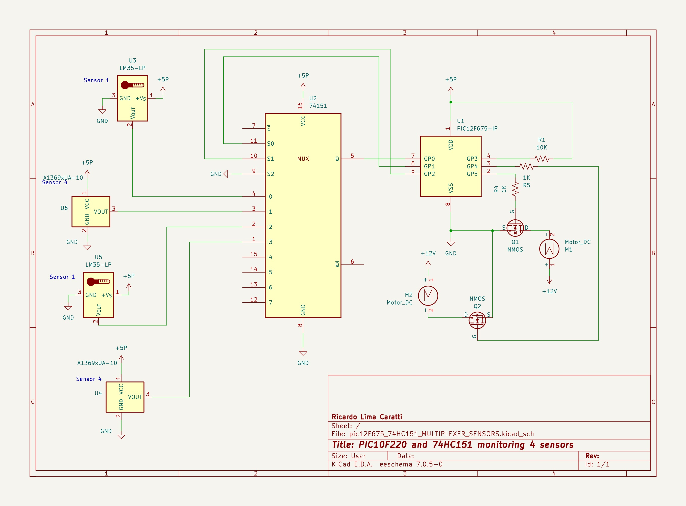

# PIC10F220 and 74HC151 MULTIPLEXER 

This folder showcases the processing of analog readings from various sensors using the PIC10F220 and the 74HC151 multiplexer.

## Content

1. [Overview](#overview)
2. [About this project](#about-this-project)
8. [References](#references)

## Overview

When exploring applications that necessitate analog input, the PIC10F220 stands out as a preferable choice over the PIC10F200. Retaining the foundational attributes of the PIC10F200, the PIC10F220 sets itself apart with the integration of an Analog-to-Digital Converter (ADC) interface. This feature substantially elevates the functionality of the PIC10F220, granting it the ability to directly process analog signals. This functionality is pivotal for projects that demand the monitoring or measuring of analog values. Adding to this, when combined with the 74HC151 multiplexer, the PIC10F220's analog input capabilities can be expanded even further. This synergy allows for the efficient management of multiple analog signals, enhancing the microcontroller's utility in complex environments where space and pin limitations are a concern, yet precise analog data acquisition is required.

## About this project 

This project collects data from four analog sensors, including two LM35 temperature sensors and two current sensors. Based on the analog values read by the PIC10F220 through the 74HC151 multiplexer, one or two cooling fans will be activated.

It's important to highlight that since these are analog sensors, which typically produce a voltage between 0 and 5V depending on the magnitude they are designed to measure, it is easily feasible to replace them with other types of analog sensors as required by the application.

## PIC10F220 and 74HC151 monitoring 4 sensors

The table below shows the values of GP1 and GP2 and the respective sensor 

|          ANALOG SENSOR                |  GP1   |  GP2   |  
| --------------------------------------| ------ | ------ |
| Sensor 1 - Temperature sensor (LM35)  |   0    |   0    |
| Sensor 2 - Current Sensor             |   0    |   1    |
| Sensor 3 - Temperature sensor (LM35)  |   1    |   0    |
| Sensor 4 - Current Sensor             |   1    |   1    |

## PIC10F220 PINOUT

## 74HC151 PINOUT 

The 74HC151 is an 8-input multiplexer with three select inputs (S0, S1, S2), eight data inputs (D0 to D7), one output (Y) or (Q), one complementary output Y' or  Q', one enable input (E), and two power supply pins (Vcc and GND). Here's a description of each pin:

1. **D0 to D7 (Data Inputs)**: These are the eight inputs of the multiplexer. Depending on the state of the select inputs (S0, S1, S2), one of these data inputs is passed through to the output.

2. **S0, S1, S2 (Select Inputs)**: These three pins are used to select one of the eight data inputs to be passed to the output. The combination of these inputs, being either high (1) or low (0), determines which data input (D0 to D7) is connected to the output.

3. **Y (Output)**: This is the multiplexer’s main output. It carries the signal from the selected data input (D0 to D7), depending on the configuration of the select inputs (S0, S1, S2).

4. **Y' (Complementary Output)**: This output is the inverse of the Q output. If Y is high, Y' will be low, and vice versa.

5. **E (Enable Input)**: This active low input enables the multiplexer’s operation. When E is low, the multiplexer functions normally, and the selected input is passed to the output. When E is high, both outputs Y and Y' are disabled, typically resulting in a high impedance state at the outputs, effectively disconnecting the output from the circuit.

6. **Vcc (Power Supply)**: This pin connects to the positive supply voltage. For the 74HC151, this is typically +5V.

7. **GND (Ground)**: This is the ground pin, which should be connected to the system’s ground.

This configuration allows the 74HC151 to select one of eight signals to be passed to its output, controlled by the select inputs and enabled by the E pin, making it highly useful in digital circuits for signal routing and data selection.

## References

* [74HC151 8-input multiplexer](https://assets.nexperia.com/documents/data-sheet/74HC_HCT151.pdf)
* [CDx4HC151, CDx4HCT151 High-Speed CMOS Logic 8-Input Multiplexer](https://www.ti.com/lit/ds/symlink/cd74hct151.pdf?ts=1711584749742)

