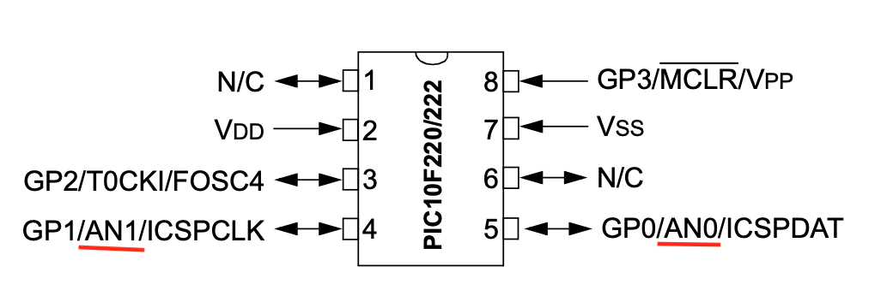

# PIC10F220 and 74HC151 MULTIPLEXER 

This folder showcases the processing of analog readings from various sensors using the PIC10F220 and the 74HC151 multiplexer.

## Content

1. [Overview](#overview)
2. [About this project](#about-this-project)
8. [References](#references)

## Overview

When exploring applications that necessitate analog input, the PIC10F220 stands out as a preferable choice over the PIC10F200. Retaining the foundational attributes of the PIC10F200, the PIC10F220 sets itself apart with the integration of an Analog-to-Digital Converter (ADC) interface. This feature substantially elevates the functionality of the PIC10F220, granting it the ability to directly process analog signals. This functionality is pivotal for projects that demand the monitoring or measuring of analog values. Adding to this, when combined with the 74HC151 multiplexer, the PIC10F220's analog input capabilities can be expanded even further. This synergy allows for the efficient management of multiple analog signals, enhancing the microcontroller's utility in complex environments where space and pin limitations are a concern, yet precise analog data acquisition is required.

## About this project 

This project collects data from four analog sensors, including two LM35 temperature sensors and two current sensors. Based on the analog values read by the PIC10F220 through the 74HC151 multiplexer, one or two cooling fans will be activated.

It's important to highlight that since these are analog sensors, which typically produce a voltage between 0 and 5V depending on the magnitude they are designed to measure, it is easily feasible to replace them with other types of analog sensors as required by the application.

## PIC10F220 and 74HC151 monitoring 4 sensors

- Sensor 1 - Temperature sensor
- Sensor 2 - Sound sensor 
- Sensor 3 - LDR
- Sensor 4 - Currente Sensor

## PIC10F220 PINOUT

## References

