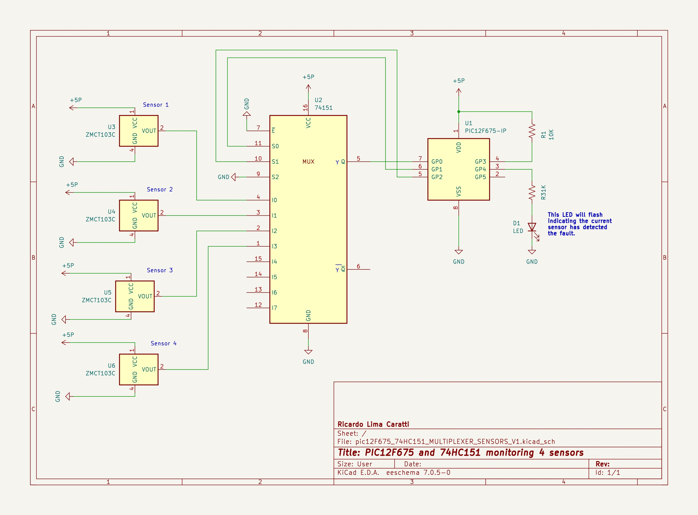

# PIC12F675 and 74HC151 MULTIPLEXER 

This folder showcases the processing of analog readings from various sensors using the PIC12F675 and the 74HC151 multiplexer.

## Content

1. [Overview](#overview)
2. [About this project](#about-this-project)
3. [Schematic - PIC12F675 and 74HC151 monitoring 4 sensors](#pic12f675-and-74hc151-monitoring-4-sensors)
    * [KiCad Schematic](./KiCad/)
8. [References](#references)

## Overview

The PIC12F675 is a compact, versatile microcontroller from Microchip's PIC12F series, offering a mix of analog and digital functionalities in a small 8-pin package. This microcontroller stands out for its integrated 10-bit Analog-to-Digital Converter (ADC), which supports up to four analog inputs, allowing for direct interfacing with various sensors and analog signals. These analog channels make the PIC12F675 particularly suitable for applications requiring the measurement of physical parameters such as temperature, light intensity, or other analog sensor data.

Although the PIC12F675 features four analog inputs (AN0, AN1, AN2, and AN3), dedicating all of these for analog readings can render it impractical due to the limited number of pins remaining for other crucial functionalities, such as triggering alerts for external modules. For applications necessitating the analog monitoring of multiple sensors, leveraging a multiplexer such as the 74HC151 offers a practical solution. This approach enables the efficient connection of up to eight sensors to the system, optimizing resource use while maintaining functionality. Once again, the purpose of this experiment is merely to demonstrate the interfacing of the 74HC151 multiplexer with the microcontroller, without necessarily making a judgment on the strategy employed to address a potential problem.

## About this project 

This project is designed to gather data from four ZMCT103C analog current sensors. Utilizing the PIC12F675 microcontroller in conjunction with the 74HC151 multiplexer, it precisely reads the analog signals generated by the sensors. Based on these readings, the system is programmed to emit an alert under specific conditions. This setup highlights an efficient use of hardware to monitor electrical currents, seamlessly integrating analog input collection with digital processing for timely alert notifications.

The concept of this system is to monitor four loads powered by alternating current (household electricity). If for any reason any load is turned off, the system triggers an alert. To achieve this, it employs the ZMCT103C current sensor.

As the previously suggested, the concepts used in this experiment can be applied to a wide range of applications, from simply recording or notifying of a power failure to activating a power contingency system via a generator set.

It's important to highlight that since these are analog sensors, which typically produce a voltage between 0 and 5V depending on the magnitude they are designed to measure, it is easily feasible to replace them with other types of analog sensors as required by your application.

## PIC12F675 and 74HC151 monitoring 4 sensors

Please note in the previous diagram that pin S2 is not used and is set to a logical level 0 (GND). This is because only four sensors are being utilized, and all combinations required to select one of the four sensors can be achieved through the combination of S0 and S1 (00, 01, 10, and 11). **It's important to note that in this case, S0 serves as the least significant bit (LSB), while S1 acts as the most significant bit (MSB).**

The table below shows the values of the PIC12F220 pins, detailing the combination of GP1 (connected to S0) and GP2 (connected to S1), along with the corresponding sensor selection. 

| ANALOG SENSOR |  S0 / GP1  |  S1 / GP2 | S3 / GND |   
| --------------| ---------  | --------- | -------- |
| Sensor 1      |     0      |    0      |     0    |
| Sensor 2      |     0      |    1      |     0    |
| Sensor 3      |     1      |    0      |     0    |
| Sensor 4      |     1      |    1      |     0    |

## PIC12F675 PINOUT

The PIC12F675 is a part of Microchip's PIC12F series of microcontrollers, which are known for their compact size and efficiency in simple applications. Here's a breakdown of each pin's function on the PIC12F675:

1. **GP0/AN0 (Pin 7)**: This pin serves as a general-purpose input/output (GPIO) pin and can also function as an analog input (AN0). It's often used for reading analog values when the microcontroller's analog-to-digital converter (ADC) is utilized. **In this application, this pin is used as analog input**.

2. **GP1/AN1 (Pin 6)**: Similar to GP0, this pin can be used as either a GPIO or an analog input (AN1). This versatility allows for flexibility in connecting various sensors or input devices. **In this application this pin is used as digital output (LSB) of sensor selection**. 

3. **GP2/AN2/INT/COUT/VREF (Pin 5)**: This multi-functional pin can act as a GPIO, an analog input (AN2), an external interrupt input (INT), a comparator output (COUT), or a voltage reference (VREF). Its diverse functions enable it to support a wide range of applications.

4. **GP3/MCLR/VPP (Pin 4)**: This pin is used as the Master Clear (Reset) input (MCLR) when configured as an input. It can also function as the programming voltage input (VPP) during In-Circuit Serial Programming (ICSP). Note that GP3 is input-only and has an internal weak pull-up.

5. **GP4/AN3/T0CKI/CIN+ (Pin 3)**: This pin offers functionalities such as GPIO, analog input (AN3), timer0 clock input (T0CKI), and positive input to the comparator (CIN+). It's useful for timing applications and analog signal processing.

6. **GP5/CIN-/OSC1/CLKIN (Pin 2)**: GP5 serves multiple roles, including GPIO, negative input to the comparator (CIN-), and oscillator input (OSC1/CLKIN) for external clock sources.

7. **OSC2/CLKOUT (Pin 8)**: This pin can be used as an oscillator output (OSC2/CLKOUT) for clocking external devices or for feedback in resonator configurations. It's also involved in the microcontroller's internal clock generation system.

8. **VDD (Pin 1)**: This is the positive power supply pin. The PIC12F220 typically operates at a voltage range of 2.0V to 5.5V.

9. **VSS (Pin 8)**: This pin is the ground (GND) connection for the microcontroller.

## 74HC151 PINOUT 

The 74HC151 is an 8-input multiplexer with three select inputs (S0, S1, S2), eight data inputs (I0 to I7), one output (Y) or (Q), one complementary output Y' or  Q', one enable input (E), and two power supply pins (Vcc and GND). Here's a description of each pin:

1. **I0 to I7 (Data Inputs)**: These are the eight inputs of the multiplexer. Depending on the state of the select inputs (S0, S1, S2), one of these data inputs is passed through to the output.

2. **S0, S1, S2 (Select Inputs)**: These three pins are used to select one of the eight data inputs to be passed to the output. The combination of these inputs, being either high (1) or low (0), determines which data input (D0 to D7) is connected to the output.

3. **Y (Output)**: This is the multiplexer’s main output. It carries the signal from the selected data input (D0 to D7), depending on the configuration of the select inputs (S0, S1, S2).

4. **Y' (Complementary Output)**: This output is the inverse of the Q output. If Y is high, Y' will be low, and vice versa.

5. **E (Enable Input)**: This active low input enables the multiplexer’s operation. When E is low, the multiplexer functions normally, and the selected input is passed to the output. When E is high, both outputs Y and Y' are disabled, typically resulting in a high impedance state at the outputs, effectively disconnecting the output from the circuit.

6. **Vcc (Power Supply)**: This pin connects to the positive supply voltage. For the 74HC151, this is typically +5V.

7. **GND (Ground)**: This is the ground pin, which should be connected to the system’s ground.

This configuration allows the 74HC151 to select one of eight signals to be passed to its output, controlled by the select inputs and enabled by the E pin, making it highly useful in digital circuits for signal routing and data selection.

## References

* [74HC151 8-input multiplexer](https://assets.nexperia.com/documents/data-sheet/74HC_HCT151.pdf)
* [CDx4HC151, CDx4HCT151 High-Speed CMOS Logic 8-Input Multiplexer](https://www.ti.com/lit/ds/symlink/cd74hct151.pdf?ts=1711584749742)

