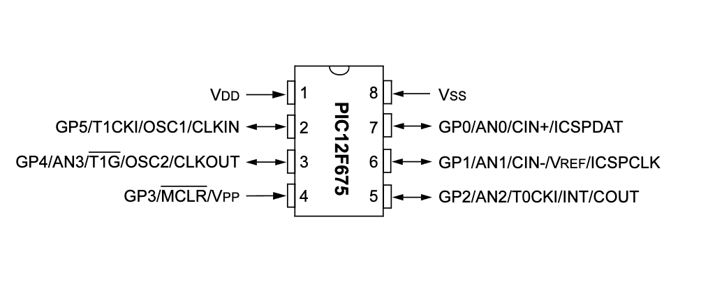

# PIC12F675 and 74HC4067 MULTIPLEXER 

This folder showcases the processing of analog readings from various sensors using the PIC12F675 and the 74HC4067 analog multiplexer.

## Content

1. [Overview](#overview)
2. [About this project](#about-this-project)
3. [Schematic - PIC12F675 and 74HC4067 monitoring 4 sensors](#pic12f675-and-74HC4067-monitoring-4-sensors)
    * [KiCad Schematic](./KiCad/)
8. [References](#references)

## Overview

The PIC12F675 is a compact, versatile microcontroller from Microchip's PIC12F series, offering a mix of analog and digital functionalities in a small 8-pin package. This microcontroller stands out for its integrated 10-bit Analog-to-Digital Converter (ADC), which supports up to four analog inputs, allowing for direct interfacing with various sensors and analog signals. These analog channels make the PIC12F675 particularly suitable for applications requiring the measurement of physical parameters such as temperature, light intensity, or other analog sensor data.

Although the PIC12F675 features four analog inputs (AN0, AN1, AN2, and AN3), dedicating all of these for analog readings can render it impractical due to the limited number of pins remaining for other crucial functionalities, such as triggering alerts for external modules. For applications necessitating the analog monitoring of multiple sensors, leveraging a multiplexer such as the 74HC4067 offers a practical solution. This approach enables the efficient connection of up to eight sensors to the system, optimizing resource use while maintaining functionality. Once again, the purpose of this experiment is merely to demonstrate the interfacing of the 74HC4067 multiplexer with the microcontroller, without necessarily making a judgment on the strategy employed to address a potential problem.

## About this project 

This project with the PIC12F675 and the 74HC4067 can gather data from up to 8 LM35 or TMP36 temperature sensors, or even a combination of both. The program allows for individual calibration for each sensor. This way, it is possible to standardize the behavior of the sensors or to alert about different temperatures in different objects.

Although the 74HC4067 device allows for up to 16 addressable analog sensors through a combination of 4 bits (S0, S1, S2, and S3), in the configuration with the PIC12F675, it is only possible to address a maximum of 8 sensors. This is because there are not enough digital output pins on the PIC12F675 to fully utilize the 74HC4067.

It's important to highlight that since these are analog sensors, which typically produce a voltage between 0 and 5V depending on the magnitude they are designed to measure, it is easily feasible to replace them with other types of analog sensors as required by your application.

## PIC12F675 and 74HC4067 monitoring up to 8 analog sensors

The table below showcases the combinations for sensor selection based on the high and low values of the GP0, GP1, and GP2 pins of the PIC12F675, which are connected to the S0, S1, and S2 pins of the 74HC4067 device, respectively. It's important to note that the S3 pin of the 74HC4067 will not be used due to pin limitations on the PIC12F675. This way, S3 must be connected to GND.

| ANALOG SENSOR |  S3 / GND  |  S2 / GP2  |  S1 / GP1 | S0 / GP0 |   
| --------------| -----------| ---------  | --------- | -------- |
| Sensor 0      |     0      |     0      |    0      |     0    |
| Sensor 1      |     0      |     0      |    0      |     1    |
| Sensor 2      |     0      |     0      |    1      |     0    |
| Sensor 3      |     0      |     0      |    1      |     1    |
| Sensor 4      |     0      |     1      |    0      |     0    |
| Sensor 5      |     0      |     1      |    0      |     1    |
| Sensor 6      |     0      |     1      |    1      |     0    |
| Sensor 7      |     0      |     1      |    1      |     1    |

## PIC12F675 PINOUT

The PIC12F675 is a part of Microchip's PIC12F series of microcontrollers, which are known for their compact size and efficiency in simple applications. Here's a breakdown of each pin's function on the PIC12F675:

1. **GP0/AN0 (Pin 7)**: This pin serves as a general-purpose input/output (GPIO) pin and can also function as an analog input (AN0). It's often used for reading analog values when the microcontroller's analog-to-digital converter (ADC) is utilized. **In this application, this pin is used as analog input**.

2. **GP1/AN1 (Pin 6)**: Similar to GP0, this pin can be used as either a GPIO or an analog input (AN1). This versatility allows for flexibility in connecting various sensors or input devices. **In this application this pin is used as digital output (LSB) of sensor selection**. 

3. **GP2/AN2/INT/COUT/VREF (Pin 5)**: This multi-functional pin can act as a GPIO, an analog input (AN2), an external interrupt input (INT), a comparator output (COUT), or a voltage reference (VREF). Its diverse functions enable it to support a wide range of applications.

4. **GP3/MCLR/VPP (Pin 4)**: This pin is used as the Master Clear (Reset) input (MCLR) when configured as an input. It can also function as the programming voltage input (VPP) during In-Circuit Serial Programming (ICSP). Note that GP3 is input-only and has an internal weak pull-up.

5. **GP4/AN3/T0CKI/CIN+ (Pin 3)**: This pin offers functionalities such as GPIO, analog input (AN3), timer0 clock input (T0CKI), and positive input to the comparator (CIN+). It's useful for timing applications and analog signal processing.

6. **GP5/CIN-/OSC1/CLKIN (Pin 2)**: GP5 serves multiple roles, including GPIO, negative input to the comparator (CIN-), and oscillator input (OSC1/CLKIN) for external clock sources.

7. **OSC2/CLKOUT (Pin 8)**: This pin can be used as an oscillator output (OSC2/CLKOUT) for clocking external devices or for feedback in resonator configurations. It's also involved in the microcontroller's internal clock generation system.

8. **VDD (Pin 1)**: This is the positive power supply pin. The PIC12F220 typically operates at a voltage range of 2.0V to 5.5V.

9. **VSS (Pin 8)**: This pin is the ground (GND) connection for the microcontroller.

## 74HC4067 PINOUT 

The 74HC4067 is a 16-channel analog multiplexer/demultiplexer integrated circuit, featuring multiple pins for various functions. 

- **Vcc (24)**: This is the power supply pin, which powers the device. It typically operates at a voltage range from 2V to 6V.
-  **S0 to S3**: These are the select pins used to choose one of the 16 available channels. By applying a combination of HIGH and LOW signals to these four pins, a specific channel is selected for communication.
-  **COMMON INPUT/OUTPU (1)**: The common input/output pin. In multiplexer mode, it serves as the output through which the selected channel's signal is sent. In demultiplexer mode, it serves as the common input that is routed to the selected output channel.
-  **E (15)**: Enable pin. When this pin is LOW, the device operates normally. If set HIGH, all channels are disconnected from the common Z pin, effectively disabling the device.
-  **I0 to I15**: These are the input/output pins for each of the 16 channels. In multiplexer mode, signals from any of these pins can be sent to the "COMMON INPUT/OUTPU" pin when the corresponding channel is selected. In demultiplexer mode, the signal from the "COMMON INPUT/OUTPU" pin can be routed to any of these pins, depending on which channel is selected.
-  **GND (12)**: Ground pin, which is connected to the circuit's ground.

The image below shows the 74HC4067 pinout.

## Contribution

If you've found value in this repository, please consider contributing. Your support will assist me in acquiring new components and equipment, as well as maintaining the essential infrastructure for the development of future projects. [Click here](https://www.paypal.com/donate/?business=LLV4PHKTXC4JW&no_recurring=0&item_name=Your+support+will+assist+me+in++maintaining+the+essential+infrastructure+for+the+development+of+future+projects.+&currency_code=BRL) to make a donation or scan the QR code provided below. 

## References

- [74HC4067; 74HCT4067 Data Sheet](https://www.mouser.com/datasheet/2/302/74HC_HCT4067-224948.pdf)
- [74HC4067 Data Sheet](https://www.ti.com/lit/ds/symlink/cd74hc4067.pdf?ts=1712408119726&ref_url=https%253A%252F%252Fwww.ti.com%252Fproduct%252FCD74HC4067%253Futm_source%253Dgoogle%2526utm_medium%253Dcpc%2526utm_campaign%253Dasc-int-null-44700045336317248_prodfolderdynamic-cpc-pf-google-wwe_int%2526utm_content%253Dprodfolddynamic%2526ds_k%253DDYNAMIC+SEARCH+ADS%2526DCM%253Dyes%2526gad_source%253D1%2526gclid%253DCj0KCQjw5cOwBhCiARIsAJ5njua--idu3oMmmJlBPdJG1XiHKPkUcuo6TcF6jwI5wmPTOeduiskG2oAaAoujEALw_wcB%2526gclsrc%253Daw.ds)
