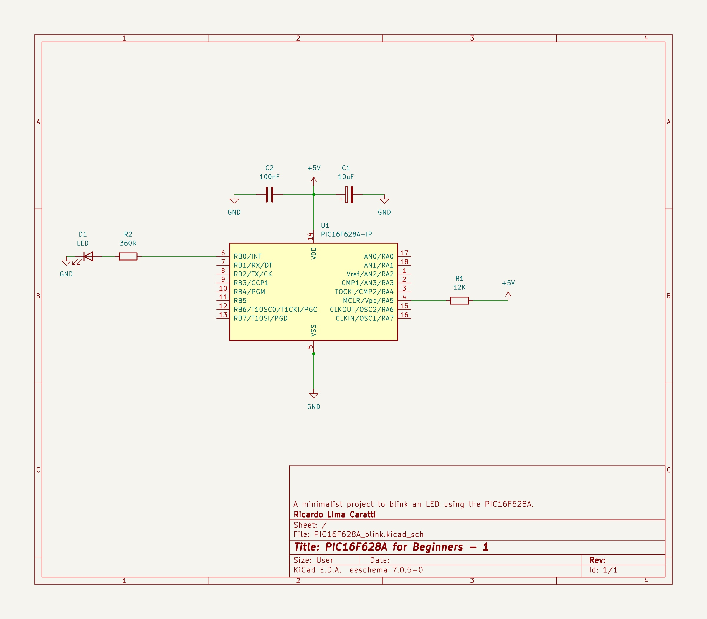

# BLINK with PIC16F628A

A minimalist project to blink an LED using the PIC16F628A.


## Schematic




## Example


```cpp
#include <xc.h>

// Configuração do microcontrolador
#pragma config FOSC = INTOSCIO  // Internal oscillator.
#pragma config WDTE = OFF       // Watchdog Timer disabled 
#pragma config PWRTE = OFF      // Power-up Timer disable
#pragma config MCLRE = ON       // MCLR pin function is digital input
#pragma config BOREN = OFF      // Brown-out Reset enabled
#pragma config LVP = OFF        // Low Voltage Programming disabled
#pragma config CPD = OFF        // Data EEPROM Memory Code Protection disabled
#pragma config CP = OFF         // Flash Program Memory Code Protection disabled

#define _XTAL_FREQ 4000000      // internal clock

void main() {
    TRISB = 0x00; // 
    PORTB =  0x0; // turn all PORTB pins low

    while (1) {
        PORTB = 0x01;
        __delay_ms(1000); 
        PORTB = 0x0;
        __delay_ms(1000); 
    }
}

```


