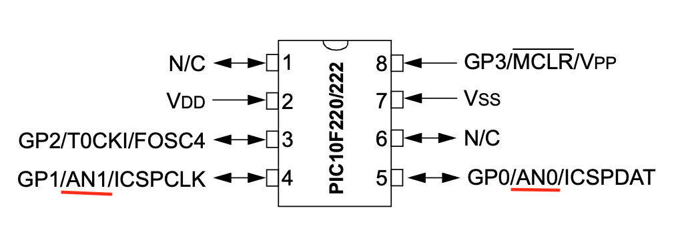

# PIC10F, PIC12F and PIC16F

This folder contains a variety of projects programmed in both C and Assembly. Generally, where appropriate, there are versions in both C and Assembly for the same project. The microcontrollers used include the PIC10F200, PIC12F675, PIC16F268A, PIC16F877, and PIC18F.

Within each project, there is a subfolder named MPLAB_EXAMPLES. Here, you can compile, debug, and load the program onto the microcontroller using the [MPLAB X IDE](https://www.microchip.com/en-us/tools-resources/develop/mplab-x-ide), which is freely available for download from Microchip. Additionally, each project contains a circuit schematic located in a folder named [KiCad](https://www.kicad.org/), the tool used for circuit design.

The following are the main characteristics of the microcontrollers used in this repository.

## PIC16F628A PINOUT

1. **RA0/AN0 (Port A, Bit 0/Analog Channel 0)**: Digital I/O pin or analog input.
2. **RA1/AN1 (Port A, Bit 1/Analog Channel 1)**: Digital I/O pin or analog input.
3. **RA2/AN2/VREF-/COUT (Port A, Bit 2/Analog Channel 2/Voltage Reference-/Comparator Output)**: Digital I/O pin, analog input, voltage reference, or comparator output.
4. **RA3/MCLR/VPP (Port A, Bit 3/Master Clear/Programming Voltage)**: Used as a Master Clear Reset input or programming voltage input.
5. **RA4/T0CKI (Port A, Bit 4/Timer0 Clock Input)**: Digital I/O pin or Timer0 clock input.
6. **RA5/AN4/SS/T0CKI/C2OUT (Port A, Bit 5/Analog Channel 4/SPI Slave Select/Timer0 Clock Input/Comparator 2 Output)**: Digital I/O pin, analog input, SPI slave select, Timer0 clock input, or Comparator 2 output.
7. **VSS (Ground)**: Ground reference for the power supply.
8. **RB0/INT (Port B, Bit 0/External Interrupt)**: Digital I/O pin or external interrupt.
9. **RB1 (Port B, Bit 1)**: Digital I/O pin.
10. **RB2 (Port B, Bit 2)**: Digital I/O pin.
11. **RB3 (Port B, Bit 3)**: Digital I/O pin.
12. **RB4 (Port B, Bit 4)**: Digital I/O pin.
13. **RB5 (Port B, Bit 5)**: Digital I/O pin.
14. **RB6/PGC (Port B, Bit 6/Programming Clock)**: Digital I/O pin or programming clock for ICSP (In-Circuit Serial Programming).
15. **RB7/PGD (Port B, Bit 7/Programming Data)**: Digital I/O pin or programming data for ICSP.
16. **VDD (Power Supply)**: Positive supply voltage.
17. **VSS (Ground)**: Ground reference for the power supply.
18. **OSC1/CLKIN (Oscillator pin 1/Clock Input)**: Input for an external oscillator or clock signal.
19. **OSC2/CLKOUT (Oscillator pin 2/Clock Output)**: Output from the internal oscillator or clock signal.
20. **RC0/T1OSO/T13CKI (Port C, Bit 0/Timer1 Oscillator Output/Timer1 Gate Input)**: Digital I/O pin, Timer1 oscillator output, or Timer1 gate input.
21. **RC1/T1OSI/CCP2 (Port C, Bit 1/Timer1 Oscillator Input/Capture Compare PWM 2)**: Digital I/O pin, Timer1 oscillator input, or CCP2 (Capture/Compare/PWM) module.
22. **RC2/CCP1 (Port C, Bit 2/Capture Compare PWM 1)**: Digital I/O pin or CCP1 (Capture/Compare/PWM) module.
23. **RC3/SCK/SCL (Port C, Bit 3/SPI Clock/Serial Clock Line)**: Digital I/O pin, SPI clock, or I2C clock line.
24. **RC4/SDI/SDA (Port C, Bit 4/SPI Data In/I2C Data Line)**: Digital I/O pin, SPI data input, or I2C data line.
25. **RC5/SDO (Port C, Bit 5/SPI Data Out)**: Digital I/O pin or SPI data output.
26. **RC6/TX/CK (Port C, Bit 6/USART Transmit/USART External Clock)**: Digital I/O pin, USART transmit, or USART external clock.
27. **RC7/RX/DT (Port C, Bit 7/USART Receive/USART Data)**: Digital I/O pin, USART receive, or USART data.
28. **VDD (Power Supply)**: Positive supply voltage.

## PIC16F887 PINOUT

1. **RA0/AN0 (Port A Bit 0/Analog Channel 0)**: Digital I/O pin or analog input channel.
2. **RA1/AN1 (Port A Bit 1/Analog Channel 1)**: Digital I/O pin or analog input channel.
3. **RA2/AN2/VREF- (Port A Bit 2/Analog Channel 2/Voltage Reference Minus)**: Digital I/O pin, analog input channel, or negative voltage reference input.
4. **RA3/AN3/VREF+ (Port A Bit 3/Analog Channel 3/Voltage Reference Plus)**: Digital I/O pin, analog input channel, or positive voltage reference input.
5. **RA4/T0CKI/C1OUT (Port A Bit 4/Timer0 Clock Input/Comparator 1 Output)**: Digital I/O pin, clock input for Timer0, or output from Comparator 1.
6. **RA5/AN4/SS/HLVDIN (Port A Bit 5/Analog Channel 4/SPI Slave Select/High/Low-Voltage Detection Input)**: Digital I/O pin, analog input channel, SPI Slave Select, or High/Low-Voltage Detection input.
7. **VSS (Ground)**: Ground reference for power supply.
8. **OSC1/CLKIN (Oscillator pin 1/Clock Input)**: Input for an external oscillator.
9. **OSC2/CLKOUT (Oscillator pin 2/Clock Output)**: Output from the oscillator or clock.
10. **RA7/OSC1/CLKI (Port A Bit 7/Oscillator1/Clock Input)**: Digital I/O pin or Oscillator/Clock input.
11. **RA6/OSC2/CLKO (Port A Bit 6/Oscillator2/Clock Output)**: Digital I/O pin or Oscillator/Clock output.
12. **RC0 (Port C Bit 0)**: Digital I/O pin.
13. **RC1 (Port C Bit 1)**: Digital I/O pin.
14. **RC2 (Port C Bit 2)**: Digital I/O pin.
15. **RC3 (Port C Bit 3)**: Digital I/O pin.
16. **VDD (Power Supply)**: Positive supply voltage.
17. **RC4 (Port C Bit 4)**: Digital I/O pin.
18. **RC5 (Port C Bit 5)**: Digital I/O pin.
19. **RC6/TX/CK (Port C Bit 6/USART Transmit/Clock)**: Digital I/O pin, USART transmit, or clock.
20. **RC7/RX/DT (Port C Bit 7/USART Receive/Data)**: Digital I/O pin, USART receive, or data.
21. **RD0 (Port D Bit 0)**: Digital I/O pin.
22. **RD1 (Port D Bit 1)**: Digital I/O pin.
23. **RD2 (Port D Bit 2)**: Digital I/O pin.
24. **RD3 (Port D Bit 3)**: Digital I/O pin.
25. **RD4 (Port D Bit 4)**: Digital I/O pin.
26. **RD5 (Port D Bit 5)**: Digital I/O pin.
27. **RD6 (Port D Bit 6)**: Digital I/O pin.
28. **RD7 (Port D Bit 7)**: Digital I/O pin.
29. **RE0/RD/AN5 (Port E Bit 0/Read/Analog Channel 5)**: Digital I/O pin or analog input channel.
30. **RE1/WR/AN6 (Port E Bit 1/Write/Analog Channel 6)**: Digital I/O pin or analog input channel.
31. **RE2/CS/AN7 (Port E Bit 2/Chip Select/Analog Channel 7)**: Digital I/O pin or analog input channel.
32. **VSS (Ground)**: Ground reference for power supply.
33. **VDD (Power Supply)**: Positive supply voltage.
34. **RB0/INT0 (Port B Bit 0/External Interrupt 0)**: Digital I/O pin or external interrupt source.
35. **RB1/INT1 (Port B Bit 1/External Interrupt 1)**: Digital I/O pin or external interrupt source.
36. **RB2/INT2 (Port B Bit 2/External Interrupt 2)**: Digital I/O pin or external interrupt source.
37. **RB3/CCP2 (Port B Bit 3/Capture Compare PWM 2)**:

## PIC16F876A PINOUT

1. **MCLR/VPP (Master Clear/Programming Voltage)**: Used to reset the microcontroller. Can also be used as the programming voltage input during programming.

2. **RA0/AN0 (Port A Bit 0/Analog Channel 0)**: Digital I/O pin or analog input channel.

3. **RA1/AN1 (Port A Bit 1/Analog Channel 1)**: Digital I/O pin or analog input channel.

4. **RA2/AN2/VREF-/CVREF (Port A Bit 2/Analog Channel 2/Voltage Reference-/Comparator Voltage Reference)**: Digital I/O pin, analog input channel, or voltage reference input for the comparator.

5. **RA3/AN3/VREF+ (Port A Bit 3/Analog Channel 3/Voltage Reference+)**: Digital I/O pin, analog input channel, or positive voltage reference input.

6. **RA4/T0CKI/C1OUT (Port A Bit 4/Timer0 Clock Input/Comparator 1 Output)**: Digital I/O pin, clock input for Timer0, or output from comparator 1.

7. **RA5/AN4/SS/C2OUT (Port A Bit 5/Analog Channel 4/SPI Slave Select/Comparator 2 Output)**: Digital I/O pin, analog input channel, SPI slave select, or output from comparator 2.

8. **VSS (Ground)**: Ground reference for the power supply.

9. **OSC1/CLKIN (Oscillator pin 1/Clock Input)**: Input for an external oscillator.

10. **OSC2/CLKOUT (Oscillator pin 2/Clock Output)**: Output from the oscillator or clock.

11. **RC0/T1OSO/T1CKI (Port C Bit 0/Timer1 Oscillator Output/Timer1 External Clock Input)**: Digital I/O pin, Timer1 oscillator output, or Timer1 external clock input.

12. **RC1/T1OSI/CCP2 (Port C Bit 1/Timer1 Oscillator Input/Capture Compare PWM 2)**: Digital I/O pin, Timer1 oscillator input, or CCP2 (Capture/Compare/PWM) module.

13. **RC2/CCP1 (Port C Bit 2/Capture Compare PWM 1)**: Digital I/O pin or CCP1 (Capture/Compare/PWM) module.

14. **RC3/SCK/SCL (Port C Bit 3/SPI Clock/Serial Clock Line)**: Digital I/O pin, SPI clock, or I2C clock line.

15. **VDD (Power Supply)**: Positive supply voltage.

16. **RC4/SDI/SDA (Port C Bit 4/SPI Data In/I2C Data Line)**: Digital I/O pin, SPI data input, or I2C data line.

17. **RC5/SDO (Port C Bit 5/SPI Data Out)**: Digital I/O pin or SPI data output.

18. **RC6/TX/CK (Port C Bit 6/USART Transmit/USART External Clock)**: Digital I/O pin, USART transmit, or USART external clock.

19. **RC7/RX/DT (Port C Bit 7/USART Receive/USART Data)**: Digital I/O pin, USART receive, or USART data.

20. **RB0/INT (Port B Bit 0/External Interrupt)**: Digital I/O pin or external interrupt source.

21. **RB1 (Port B Bit 1)**: Digital I/O pin.

22. **RB2 (Port B Bit 2)**: Digital I/O pin.

23. **RB3/PGM (Port B Bit 3/Programmable)**: Digital I/O pin or programmable logic.

24. **RB4 (Port B Bit 4)**: Digital I/O pin.

25. **RB5 (Port B Bit 5)**: Digital I/O pin.

26. **RB6/PGC (Port B Bit 6/Programming Clock)**: Digital I/O pin or programming clock input for ICSP.

27. **RB7/PGD (Port B Bit 7/Programming Data)**: Digital I/O pin or programming data for ICSP.

28. **VSS (Ground)**: Ground reference for the power supply.

## PIC12F675 PINOUT

The PIC12F series, particularly the PIC12F675, is a family of microcontrollers produced by Microchip Technology, known for their small size, low power consumption, and versatility, making them ideal for a wide range of applications. Below are the key features and pinout details of the PIC12F675, a popular model in the series.

### Key Features of PIC12F675:

1. **Core**: 8-bit PIC architecture.
2. **Memory**:
   - Flash Program Memory: Typically 1.75 KB.
   - SRAM Data Memory: 64 Bytes.
   - EEPROM Data Memory: 128 Bytes.
3. **I/O Pins**: 6 GPIO pins.
4. **Timers**: One 8-bit timer and one 16-bit timer.
5. **ADC**: 10-bit, 4-channel Analog-to-Digital Converter.
6. **Operating Voltage**: Typically 2.0-5.5V.
7. **Internal Oscillator**: 4 MHz and 8 MHz options with calibration.
8. **Power-Saving Modes**: Several, including sleep mode.
9. **Communication**: Supports ICSP (In-Circuit Serial Programming).
10. **Additional Features**: Watchdog Timer, Power-on Reset, Brown-out Reset.

### Pinout of PIC12F675:

The PIC12F675 comes in an 8-pin package with the following pin configuration:

1. **GP0 to GP5 (General Purpose I/O Pins)**: These are multi-functional pins used for general I/O, but they also serve additional functions:
   - GP0: Analog input AN0, external interrupt, ICSP data.
   - GP1: Analog input AN1, voltage reference input, ICSP clock.
   - GP2: Analog input AN2, Timer0 clock input.
   - GP3: MCLR (Master Clear) reset input, or can be used as a general I/O pin if MCLR is disabled.
   - GP4: General-purpose I/O.
   - GP5: General-purpose I/O.

2. **VDD and VSS Pins**: These are the power supply pins for the microcontroller. VDD is the positive supply voltage, and VSS is the ground.

3. **ICSP (In-Circuit Serial Programming)**: Pins GP0 and GP1 are used for ICSP, allowing the microcontroller to be programmed while placed in a circuit.

The PIC12F675 is a versatile microcontroller suitable for various applications, including simple automation, small gadgets, and hobbyist projects. Its small footprint and low power consumption, combined with its rich set of features, make it an ideal choice for projects where space and power are constrained.

## PIC10F200 

The PIC10F200 is a small, low-cost, and low-power microcontroller that is ideal for a variety of applications, including:

* **Simple digital devices**
* **Sensors**
* **Wireless devices**
* **IoT devices**

### Features:

* **Flash memory:** The PIC10F200 has 384 bytes of Flash memory, which is enough to store a small program.
* **RAM:** The PIC10F200 has 16 bytes of RAM, which is enough to store a few variables.
* **I/O pins:** The PIC10F200 has 4 I/O pins, which can be used to connect to sensors, actuators, and other devices.
* **Internal oscillator:** The PIC10F200 has an internal oscillator, which eliminates the need for an external crystal or resonator.
* **Low power consumption:** The PIC10F200 consumes very little power, making it ideal for battery-powered applications.

### PIC10F200 PINOUT

## PIC10F220 

When it comes to applications requiring analog input, the PIC10F220 emerges as a superior alternative to the PIC10F200. While inheriting the core features of the PIC10F200, the PIC10F220 distinguishes itself with the inclusion of an Analog-to-Digital Converter (ADC) interface. This addition significantly enhances the PIC10F220's functionality, enabling it to directly read analog signals. Such a capability is crucial for applications where monitoring or measuring analog parameters is essential. 

### PIC10F220 PINOUT

## References 

* [PIC16F887 Data Sheet](http://ww1.microchip.com/downloads/en/devicedoc/41291d.pdf)
* [PIC16F87XA Data Sheet](https://ww1.microchip.com/downloads/en/devicedoc/39582b.pdf)
* [PIC16F627A/628A/648A Data Sheet](https://ww1.microchip.com/downloads/en/DeviceDoc/40044G.pdf)
* [PIC10F200 Data Sheet](https://ww1.microchip.com/downloads/en/DeviceDoc/40001239F.pdf) 
* [PIC12F675 Data Sheet](https://ww1.microchip.com/downloads/en/devicedoc/41190c.pdf)
* [PIC10F220/222 Data Sheet](https://ww1.microchip.com/downloads/en/DeviceDoc/41270E.pdf)

